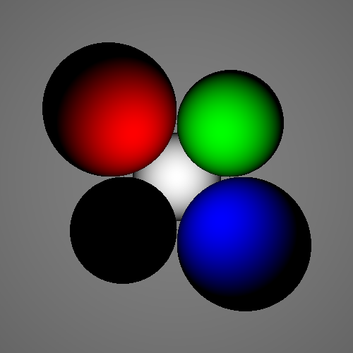

# Narcine

### The [lesser electric ray](http://en.wikipedia.org/wiki/Lesser_electric_ray)caster
====

Narcine is a rudimentary toy raycaster written in Python without (to date) using third-party libraries. Narcine is not currently in active development.

As a project intended for learning and experimentation, Narcine's structure may shift substantially from commit to commit.

## Usage

To render a test scene, run `python test_scene.py`.

## Requirements

* Python 3.X

## Features

* White point lights
* Spheres, planes
* Diffuse light
* Color

## Potential future development

* Improved color handling
* Improved lighting model
* Lights with colors
* Ray bouncing (/recursive raycasting)
* Shadow casting
* Improved documentation
* Performance
* Parallelization
* Refraction
* More shapes
* Transform-based scene composition